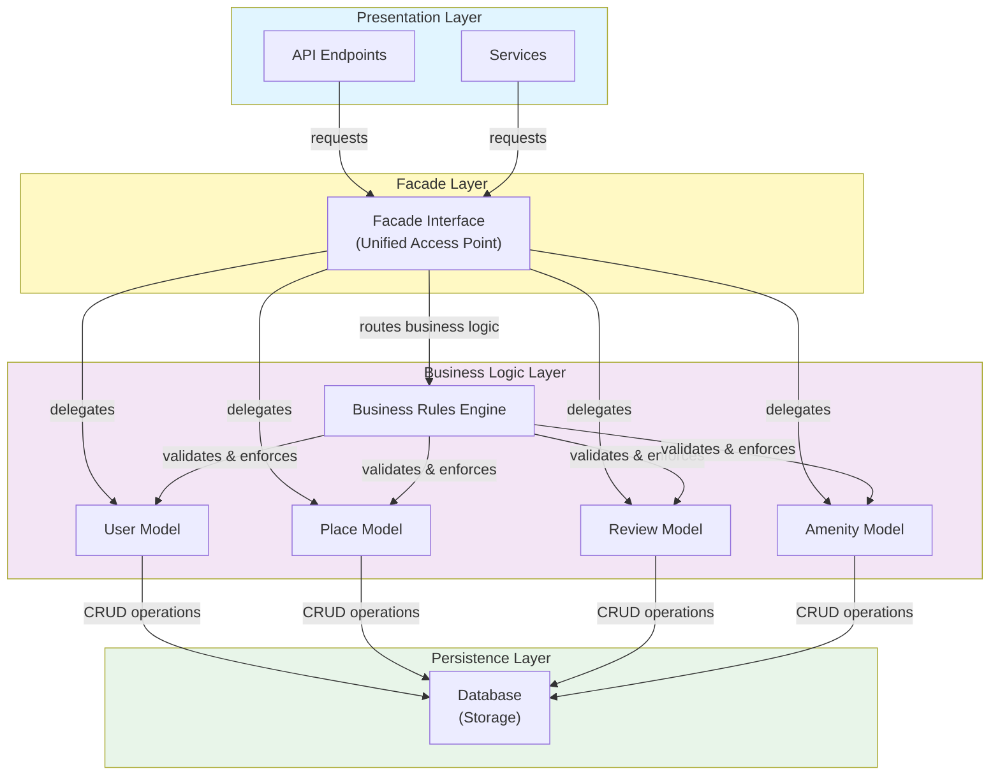
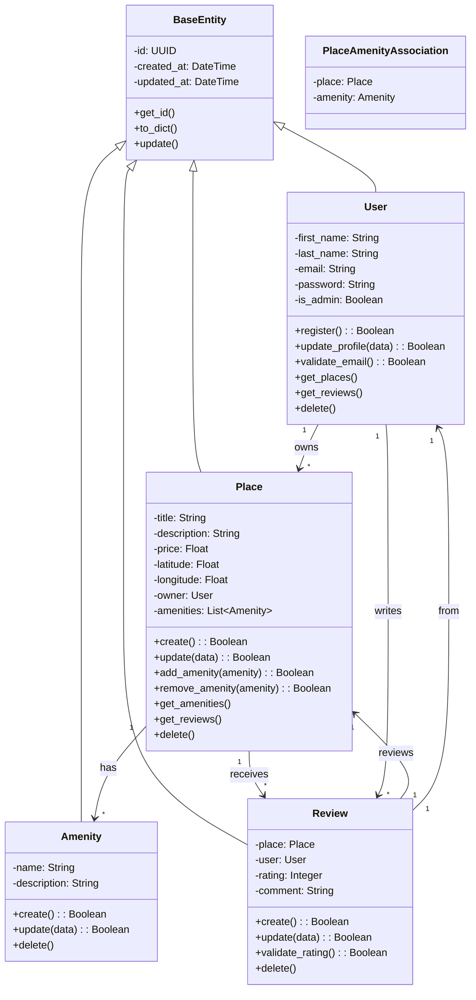
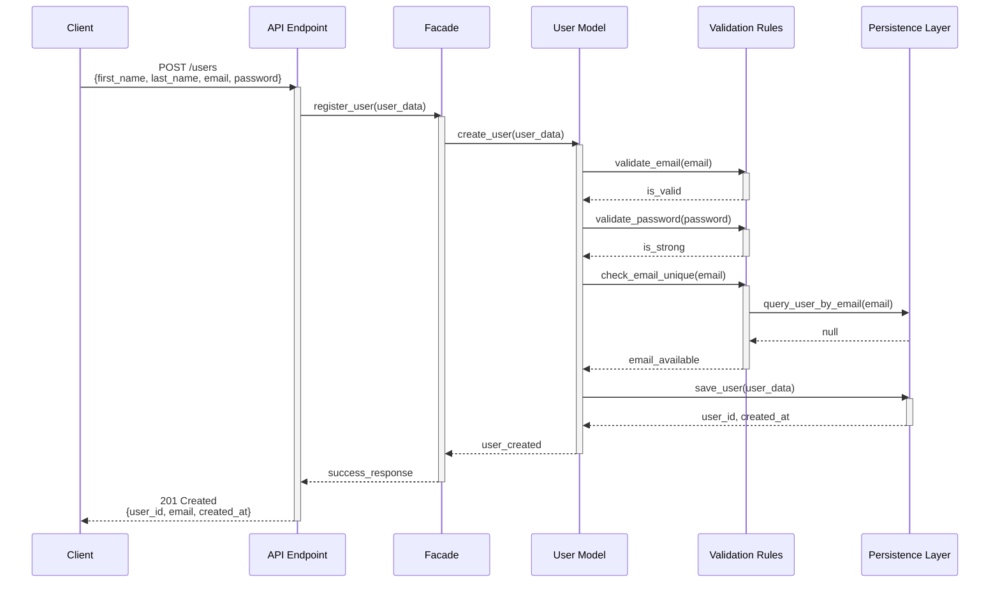
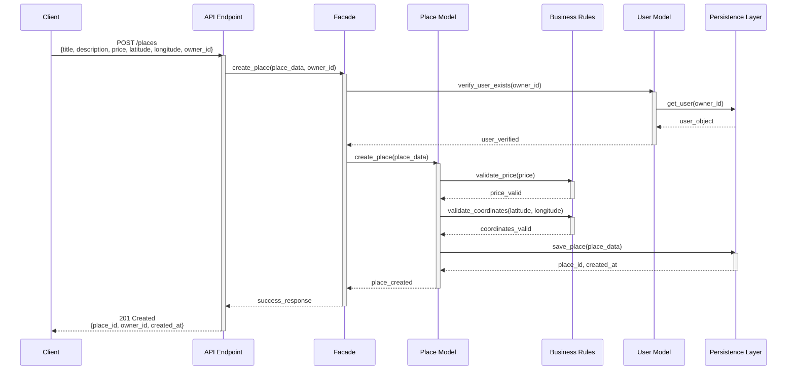
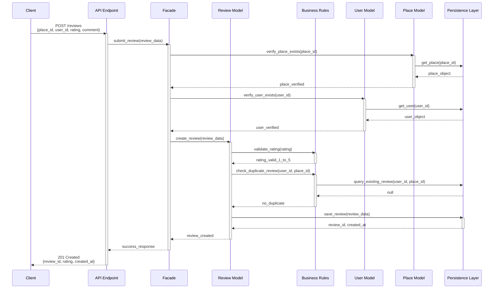
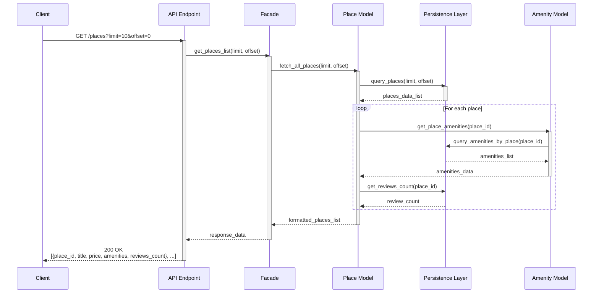
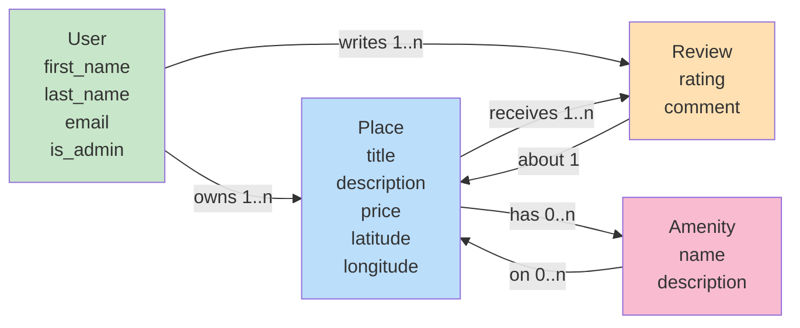
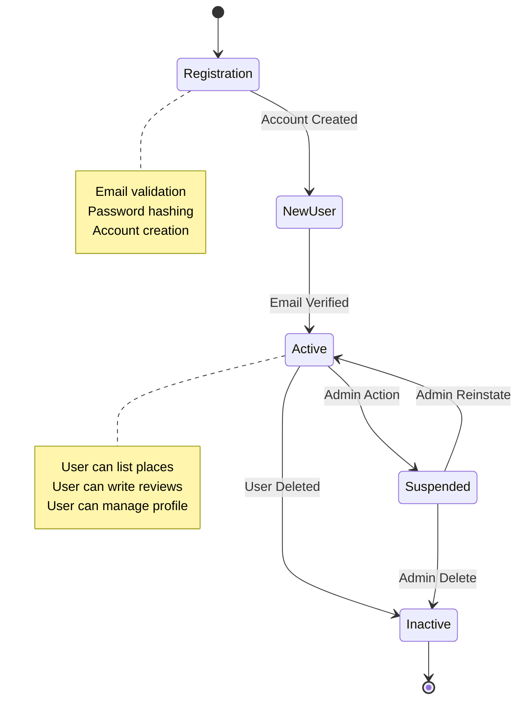

# HBnB Evolution - Mermaid Diagrams Reference

This file contains all Mermaid diagram syntax used in the technical documentation. These diagrams can be viewed in any Mermaid-compatible tool or imported into draw.io.

## Package Diagram



## Class Diagram



## Sequence Diagram 1: User Registration



## Sequence Diagram 2: Place Creation



## Sequence Diagram 3: Review Submission



## Sequence Diagram 4: Fetching Places List



## Entity Relationship Diagram



## State Diagram - User Lifecycle



## Import Instructions

### For draw.io

1. Open draw.io
2. Click "File" → "Import from" → "URL"
3. Paste the Mermaid code wrapped in mermaid tags
4. Or use the Mermaid plugin if available

### For GitHub

Mermaid diagrams render directly in markdown:

- Copy the diagram code (without backticks)
- Paste in .md file
- GitHub will render automatically

### For Confluence/Jira

1. Install Mermaid plugin
2. Use syntax:

   ```
   {{mermaid
   <diagram-code>
   }}
   ```

### For VS Code

Install the Mermaid extension and view diagrams directly.

---

## Diagram Descriptions

| Diagram | Purpose | Use Case |
| --------- | --------- | ---------- |
| Package | Show system architecture | Understanding layer organization |
| Class | Show entity relationships | Implementation guide |
| Sequence 1 | User registration flow | Test user creation |
| Sequence 2 | Place creation flow | Test property listing |
| Sequence 3 | Review submission | Test review system |
| Sequence 4 | Data retrieval | Test list endpoints |
| Entity Relationship | Show data model | Database design |
| State | Show entity lifecycle | Understand entity states |

---

**Version:** 1.0  
**Last Updated:** 2026-06-03
