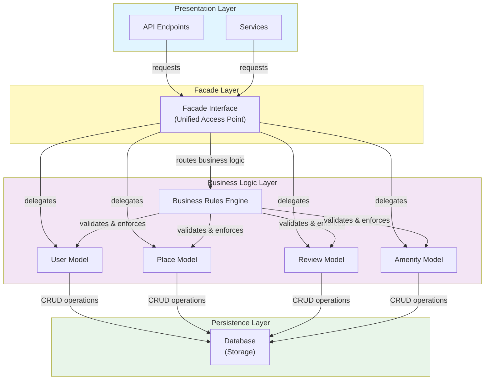
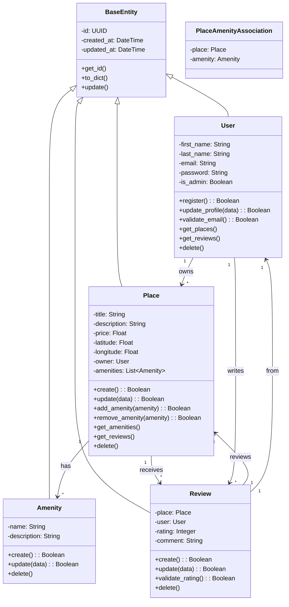
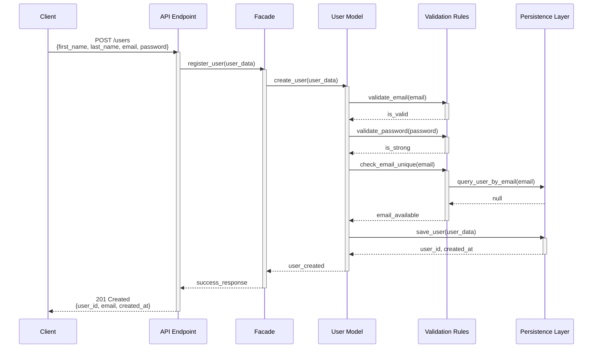
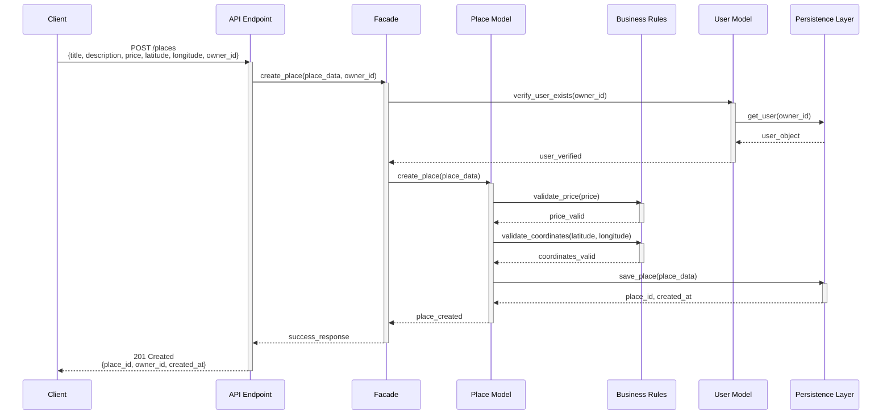
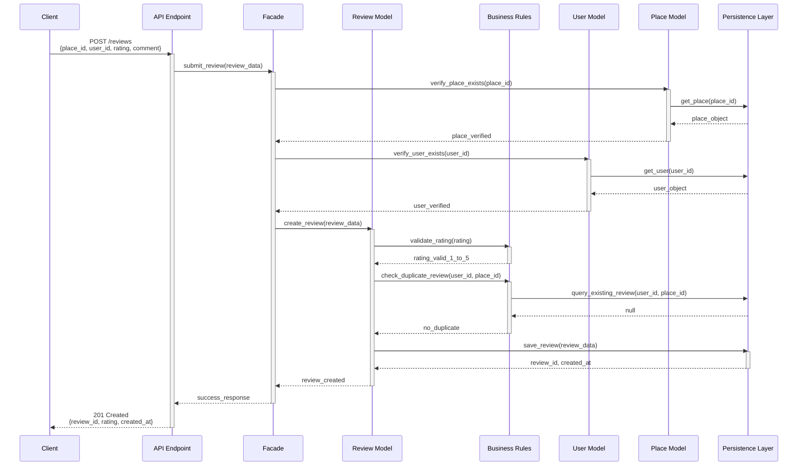
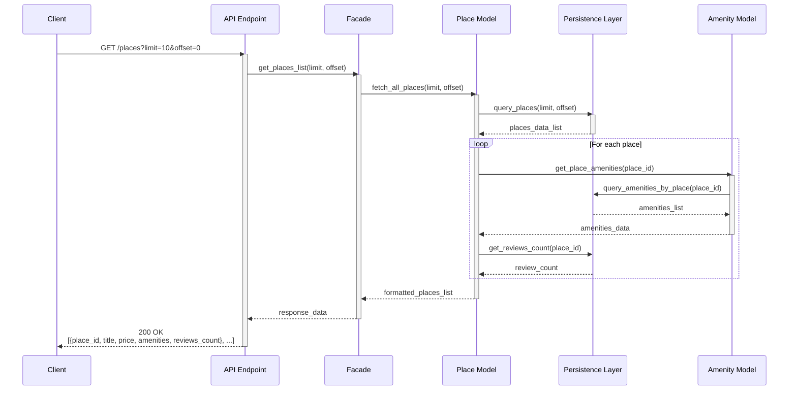

# HBnB Evolution - Technical Documentation

## Table of Contents

1. [Architecture Overview](#architecture-overview)
2. [High-Level Package Diagram](#high-level-package-diagram)
3. [Detailed Class Diagram](#detailed-class-diagram)
4. [Sequence Diagrams](#sequence-diagrams)
5. [Implementation Guidelines](#implementation-guidelines)

---

## Architecture Overview

The HBnB Evolution application follows a **three-layer architecture** pattern, separating concerns and promoting maintainability and scalability:

### Layer Responsibilities

#### 1. **Presentation Layer (Services & API)**

- **Responsibility:** Handles all user interactions and external API requests
- **Components:**
  - REST API endpoints
  - Request/response handlers
  - User interface services
  - Input validation
- **Communication:** Communicates with the Business Logic Layer through a Facade pattern
- **Key Functions:**
  - Routes incoming requests to appropriate business logic
  - Formats responses for client consumption
  - Handles HTTP methods and status codes

#### 2. **Business Logic Layer (Models & Core Logic)**

- **Responsibility:** Contains the core business rules and entity models
- **Components:**
  - User model and logic
  - Place model and logic
  - Review model and logic
  - Amenity model and logic
  - Business logic processors
- **Communication:** Receives requests from the Presentation Layer; communicates with the Persistence Layer for data operations
- **Key Functions:**
  - Enforces business rules
  - Validates data integrity
  - Orchestrates complex operations

#### 3. **Persistence Layer (Database)**

- **Responsibility:** Manages data storage and retrieval
- **Components:**
  - Database connection handlers
  - Query builders
  - Data repositories
  - ORM (Object-Relational Mapping) if applicable
- **Communication:** Receives data requests from the Business Logic Layer
- **Key Functions:**
  - CRUD operations
  - Data persistence
  - Query execution

### Facade Pattern Implementation

The **Facade pattern** serves as the unified interface between layers:

- Simplifies interactions by providing a single point of access
- Decouples layers, allowing independent modifications
- Reduces complexity for consumers of each layer
- Centralizes routing and request processing

---

## High-Level Package Diagram

### Diagram: Three-Layer Architecture with Facade Pattern

### Layer Interaction Flow

1. **Request Flow (Top-Down):**
   - Client sends request to API endpoint or Service
   - Presentation Layer routes request through Facade Interface
   - Facade Interface delegates to appropriate Business Logic model
   - Business Logic Layer applies rules and delegates to Persistence Layer
   - Persistence Layer executes database operations

2. **Response Flow (Bottom-Up):**
   - Database returns data to Persistence Layer
   - Persistence Layer returns results to Business Logic Layer
   - Business Logic Layer processes/formats results
   - Facade Interface packages response
   - Presentation Layer returns formatted response to client

---

## Detailed Class Diagram

### Complete Business Logic Layer

### Entity Details

#### User Entity

| Attribute | Type | Description |
| ----------- | ------ | ------------- |
| id | UUID | Unique identifier |
| first_name | String | User's first name |
| last_name | String | User's last name |
| email | String | User's email (unique) |
| password | String | Hashed password |
| is_admin | Boolean | Administrator flag |
| created_at | DateTime | Creation timestamp |
| updated_at | DateTime | Last update timestamp |

**Key Methods:**

- `register()` - Create new user account
- `update_profile(data)` - Modify user information
- `validate_email()` - Verify email format
- `get_places()` - Retrieve owned places
- `get_reviews()` - Retrieve written reviews
- `delete()` - Remove user account

#### Place Entity

| Attribute | Type | Description |
| ----------- | ------ | ------------- |
| id | UUID | Unique identifier |
| title | String | Place name/title |
| description | String | Detailed description |
| price | Float | Price per night |
| latitude | Float | Geographic latitude |
| longitude | Float | Geographic longitude |
| owner | User | User who owns the place |
| amenities | List | Associated amenities |
| created_at | DateTime | Creation timestamp |
| updated_at | DateTime | Last update timestamp |

**Key Methods:**

- `create()` - Create new place listing
- `update(data)` - Modify place details
- `add_amenity(amenity)` - Associate amenity with place
- `remove_amenity(amenity)` - Remove amenity association
- `get_amenities()` - Retrieve all amenities
- `get_reviews()` - Retrieve all reviews
- `delete()` - Remove place listing

#### Review Entity

| Attribute | Type | Description |
| ----------- | ------ | ------------- |
| id | UUID | Unique identifier |
| place | Place | Reviewed place reference |
| user | User | Reviewer reference |
| rating | Integer | Rating (1-5) |
| comment | String | Review text |
| created_at | DateTime | Creation timestamp |
| updated_at | DateTime | Last update timestamp |

**Key Methods:**

- `create()` - Submit new review
- `update(data)` - Edit existing review
- `validate_rating()` - Ensure rating is valid (1-5)
- `delete()` - Remove review

#### Amenity Entity

| Attribute | Type | Description |
| ----------- | ------ | ------------- |
| id | UUID | Unique identifier |
| name | String | Amenity name (e.g., "WiFi") |
| description | String | Amenity description |
| created_at | DateTime | Creation timestamp |
| updated_at | DateTime | Last update timestamp |

**Key Methods:**

- `create()` - Add new amenity type
- `update(data)` - Modify amenity details
- `delete()` - Remove amenity type

---

## Sequence Diagrams

### Sequence Diagram 1: User Registration

### Sequence Diagram 2: Place Creation

### Sequence Diagram 3: Review Submission

### Sequence Diagram 4: Fetching Places List

---

## Implementation Guidelines

### Data Flow Summary

#### Create Operations

1. Client submits data via API
2. API routes to Facade
3. Facade delegates to appropriate Model
4. Model validates data against Business Rules
5. Model checks existing data via Persistence Layer
6. If valid, Model saves to Persistence Layer
7. Response bubbles back through Facade to API

#### Read Operations

1. Client requests data via API
2. API routes to Facade
3. Facade delegates to appropriate Model
4. Model queries Persistence Layer
5. Model formats and returns data
6. Response bubbles back through Facade to API

#### Update Operations

1. Similar to Create but verifies object exists first
2. Model validates new data
3. Model updates in Persistence Layer

#### Delete Operations

1. Model verifies object exists
2. Model cascades deletes if necessary (e.g., user deletes all their places)
3. Model removes from Persistence Layer

### Key Business Rules to Implement

1. **User Management:**
   - Email must be unique
   - Password must meet security requirements
   - Only administrators can modify other users
   - Users can only modify their own information

2. **Place Management:**
   - User must exist before creating a place
   - Price must be positive
   - Coordinates must be valid (latitude: -90 to 90, longitude: -180 to 180)
   - Only place owner can modify place details

3. **Review Management:**
   - User must have placed a booking or visited the place
   - Rating must be between 1 and 5
   - One review per user per place
   - Only review author can edit/delete their review

4. **Amenity Management:**
   - Amenity names should be unique
   - Amenities are platform-wide, not per-place
   - Multiple places can share the same amenities

### Error Handling

Each layer should handle appropriate errors:

- **Presentation Layer:** HTTP status codes and error messages
- **Business Logic Layer:** Validation errors and business rule violations
- **Persistence Layer:** Database-level errors and connection issues

---

## Testing Strategy

### Unit Tests

- Test each Model class independently
- Test validation methods
- Test business logic calculations

### Integration Tests

- Test Facade communication with Models
- Test API endpoints through Facade
- Test data persistence and retrieval

### End-to-End Tests

- Test complete user workflows
- Test all four API scenarios (registration, place creation, review, fetch)

---

## Next Steps

1. **Part 2:** Implement the models and business logic based on these diagrams
2. **Part 3:** Create the database schema and persistence layer
3. **Part 4:** Develop the API endpoints using these sequences as guides

---

## Document Version

- **Version:** 1.0
- **Date:** 2026-06-03
- **Status:** Complete - Ready for Implementation
